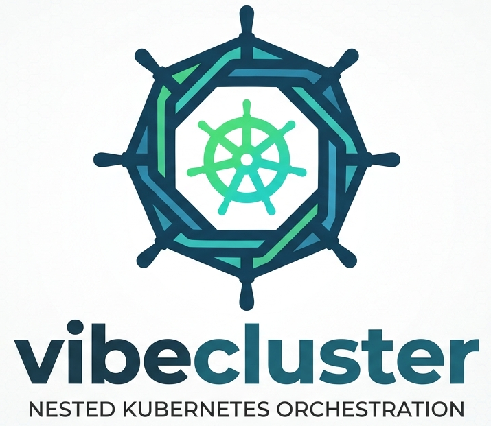

<p align="center">
  
</p>

<h1 align="center">vibecluster</h1>

<p align="center">
  Lightweight virtual Kubernetes clusters inside a host cluster.
</p>

<p align="center">
  <a href="#quick-start">Quick Start</a> &middot;
  <a href="#installation">Installation</a> &middot;
  <a href="#cli-reference">CLI Reference</a> &middot;
  <a href="#operator">Operator</a> &middot;
  <a href="#development">Development</a>
</p>

---

vibecluster creates isolated virtual clusters by deploying [k3s](https://k3s.io) as a StatefulSet in a dedicated namespace. Each virtual cluster gets its own API server, control plane, and resource isolation -- while sharing the underlying host cluster's compute.

## Architecture

```
┌──────────────────────────────────────────────────┐
│ Host Cluster                                     │
│                                                  │
│  ┌──────────────── vc-mycluster ───────────────┐ │
│  │ Namespace                                   │ │
│  │                                             │ │
│  │  ┌───────────────────────────────────────┐  │ │
│  │  │ StatefulSet: mycluster                │  │ │
│  │  │                                       │  │ │
│  │  │  ┌────────────┐  ┌────────────────┐   │  │ │
│  │  │  │ k3s server │  │ syncer sidecar │   │  │ │
│  │  │  │ (API, etcd,│  │ (pods, svc,    │   │  │ │
│  │  │  │  ctrl-mgr) │  │  cm, secrets)  │   │  │ │
│  │  │  └────────────┘  └────────────────┘   │  │ │
│  │  └───────────────────────────────────────┘  │ │
│  │                                             │ │
│  │  Service (ClusterIP :443)                   │ │
│  │  RBAC: ServiceAccount + ClusterRole         │ │
│  └─────────────────────────────────────────────┘ │
└──────────────────────────────────────────────────┘
```

The **syncer** watches the virtual cluster and syncs resources bidirectionally:

- **Virtual to Host** -- Pods, Services, ConfigMaps, Secrets (name-translated into the host namespace)
- **Host to Virtual** -- Nodes (so virtual workloads can be scheduled)

Resources created inside the virtual cluster appear in the host namespace with translated names:

| Virtual Cluster | Host Cluster |
|---|---|
| `default/my-pod` | `vc-mycluster/mycluster-x-my-pod-x-default` |
| `default/my-configmap` | `vc-mycluster/mycluster-x-my-configmap-x-default` |

## Quick Start

```bash
# Create a virtual cluster
vibecluster create mycluster

# Use it
kubectl get nodes
kubectl create deployment nginx --image=nginx

# Tear it down
vibecluster delete mycluster
```

## Installation

### Binary releases

```bash
# Linux amd64
curl -L -o vibecluster https://github.com/eatsoup/vibecluster/releases/latest/download/vibecluster-linux-amd64
chmod +x vibecluster && sudo mv vibecluster /usr/local/bin/

# macOS arm64 (Apple Silicon)
curl -L -o vibecluster https://github.com/eatsoup/vibecluster/releases/latest/download/vibecluster-darwin-arm64
chmod +x vibecluster && sudo mv vibecluster /usr/local/bin/
```

### From source

```bash
git clone https://github.com/eatsoup/vibecluster.git
cd vibecluster
make build        # Binary at ./bin/vibecluster
```

## CLI Reference

### `vibecluster create`

Creates a new virtual cluster: namespace, k3s StatefulSet, RBAC, services, and a kubeconfig.

```bash
vibecluster create mycluster
```

| Flag | Default | Description |
|---|---|---|
| `--connect` | `true` | Auto-connect after creation |
| `--timeout` | `5m` | Readiness timeout |
| `--print` | `false` | Print kubeconfig to stdout instead of writing it |
| `--mode` | `auto` | `auto`, `legacy` (raw manifests), or `operator` (require CRD) |
| `--cr-namespace` | `default` | Namespace for the `VirtualCluster` CR (operator mode) |
| `--cpu` | -- | CPU budget, e.g. `4` or `500m` (creates a ResourceQuota) |
| `--memory` | -- | Memory budget, e.g. `8Gi` |
| `--storage` | -- | PVC storage budget, e.g. `50Gi` |
| `--pods` | `0` | Max pod count (`0` = unlimited) |
| `--vnode` | `false` | Enable nested data-plane mode |

When any resource limit is set, a `LimitRange` is also installed so that pods without explicit requests are still admissible under the quota.

### `vibecluster connect`

Writes a kubeconfig for an existing virtual cluster.

```bash
vibecluster connect mycluster
vibecluster connect mycluster --print
vibecluster connect mycluster --kubeconfig ./my-kubeconfig.yaml
```

| Flag | Default | Description |
|---|---|---|
| `--server` | (auto) | Override API server address |
| `--print` | `false` | Print kubeconfig to stdout |
| `--kubeconfig` | `~/.kube/config` | Output file |

### `vibecluster expose`

Makes a virtual cluster reachable from outside the host cluster.

```bash
# Ephemeral port-forward (foreground, Ctrl+C to stop)
vibecluster expose mycluster --temp

# Persistent LoadBalancer
vibecluster expose mycluster --type LoadBalancer

# Persistent Ingress with TLS-SAN
vibecluster expose mycluster --type Ingress --host vc.example.com
```

For `--type Ingress`, the host is added to the k3s TLS-SAN list so the kubeconfig validates normally. For `--type LoadBalancer`, the generated kubeconfig uses `insecure-skip-tls-verify: true` since the assigned address is not in the server certificate.

### `vibecluster list`

```bash
vibecluster list
```

```
NAME        NAMESPACE      STATUS    MODE       CREATED
mycluster   vc-mycluster   Running   legacy     2026-04-09T19:27:30Z
dev         vc-dev         Running   operator   2026-04-09T20:15:00Z
```

### `vibecluster logs`

```bash
vibecluster logs mycluster          # syncer logs (default)
vibecluster logs mycluster -c k3s   # k3s server logs
vibecluster logs mycluster -f       # follow
```

### `vibecluster delete`

```bash
vibecluster delete mycluster
```

### Global flags

| Flag | Description |
|---|---|
| `--context` | Kubernetes context for the host cluster |

## VNode Mode

By default, virtual clusters use a flat syncer that translates workloads into the host namespace. This is lightweight but cannot enforce `NetworkPolicy` or provision in-cluster `LoadBalancer` Services -- there is no real CNI inside the virtual cluster.

VNode mode solves this by running a privileged k3s agent pod that joins the virtual API server as a real node, bringing flannel, kube-router, and klipper-lb with it.

```bash
vibecluster create mycluster --vnode
```

Each vnode cluster is allocated a unique pod and service CIDR (`/16` ranges) so multiple vnode clusters on the same host do not collide.

**Requirement:** The vnode agent pod runs as `privileged: true` on the host cluster.

## Operator

vibecluster ships a Kubernetes operator for declarative, GitOps-friendly virtual cluster management.

### Install

```bash
vibecluster operator install
```

Or with manifests directly:

```bash
kubectl apply -k https://github.com/eatsoup/vibecluster/config/operator
```

To uninstall:

```bash
vibecluster operator uninstall
```

### VirtualCluster resource

```yaml
apiVersion: vibecluster.dev/v1alpha1
kind: VirtualCluster
metadata:
  name: dev-cluster
spec:
  k3sImage: "rancher/k3s:v1.28.5-k3s1"
  syncerImage: "ghcr.io/eatsoup/vibecluster/syncer:latest"
  storage: "5Gi"
  expose:
    type: Ingress
    host: dev.vc.example.com
    ingressClass: nginx
  resources:
    cpu: "4"
    memory: "8Gi"
    storage: "50Gi"
    pods: 50
  vnode: false
```

| Field | Default | Description |
|---|---|---|
| `spec.k3sImage` | `rancher/k3s:v1.28.5-k3s1` | k3s container image |
| `spec.syncerImage` | `ghcr.io/eatsoup/vibecluster/syncer:latest` | Syncer sidecar image |
| `spec.storage` | `5Gi` | PV size for k3s data |
| `spec.expose.type` | -- | `LoadBalancer` or `Ingress` |
| `spec.expose.host` | -- | External hostname (required for Ingress) |
| `spec.expose.ingressClass` | -- | IngressClassName for Ingress |
| `spec.resources.cpu` | -- | CPU budget |
| `spec.resources.memory` | -- | Memory budget |
| `spec.resources.storage` | -- | PVC storage budget |
| `spec.resources.pods` | -- | Max pod count |
| `spec.vnode` | `false` | Enable nested data-plane mode |

### Status

```bash
kubectl get virtualclusters
```

```
NAME          PHASE     READY   NAMESPACE         AGE
dev-cluster   Running   true    vc-dev-cluster    5m
```

| Status field | Description |
|---|---|
| `phase` | `Pending`, `Running`, `Failed`, or `Deleting` |
| `ready` | `true` when the StatefulSet has ready replicas |
| `message` | Human-readable detail |
| `namespace` | Host namespace (`vc-<name>`) |
| `observedGeneration` | Last reconciled generation |

### GitOps integration

Store `VirtualCluster` manifests in Git and point ArgoCD or Flux at them:

```yaml
apiVersion: argoproj.io/v1alpha1
kind: Application
metadata:
  name: virtual-clusters
spec:
  source:
    repoURL: https://github.com/your-org/cluster-configs
    path: virtual-clusters
  destination:
    server: https://kubernetes.default.svc
    namespace: default
  syncPolicy:
    automated:
      prune: true
      selfHeal: true
```

## Development

```bash
make build              # Build CLI
make build-syncer       # Build syncer binary
make build-operator     # Build operator binary
make syncer-image       # Build syncer container image
make operator-image     # Build operator container image
make test               # Run tests
make deploy-operator    # Install CRD + deploy operator
make undeploy-operator  # Remove operator
```

## License

[MIT](LICENSE)
